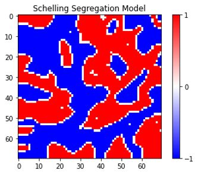

# Schelling Segregation Model Simulation

This project implements a simple agent-based model to simulate residential segregation, following the Schelling Segregation Model. The model uses a 2D grid where agents (representing people) are either of type 1 or -1, and their movement is determined by their satisfaction with their neighborhood.

## Overview

The Schelling Segregation Model shows how individual preferences can lead to large-scale patterns of segregation, even when individuals have only a mild preference for being near similar neighbors. In this simulation, agents live in a grid, and they are "happy" if a certain proportion of their neighbors are of the same type. If they are unhappy, they move to a new location.

## Features

- **2D Grid**: Agents are placed in a grid of size `height x width`, where they can be of two types (1 or -1) or the cell can be empty.
- **Agent Density**: You can control the proportion of the grid that is occupied by agents using the `density` parameter.
- **Similarity Threshold**: This threshold defines the proportion of an agent's neighbors that need to be of the same type for the agent to be satisfied.
- **Agent Movement**: Unhappy agents move to a randomly selected empty cell.
- **Visualization**: The grid is visualized using `matplotlib` where different colors represent the two types of agents.

## Requirements

- Python 3.x
- NumPy
- Matplotlib

You can install the required libraries using the following command:

```bash
pip install numpy matplotlib
```

## Output

<div style="text-align: center;">
  
</div>
